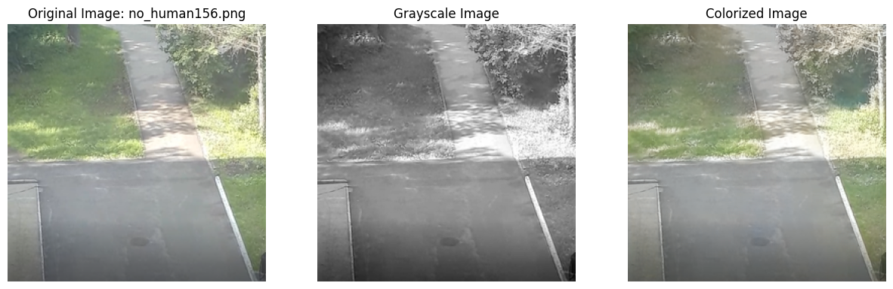
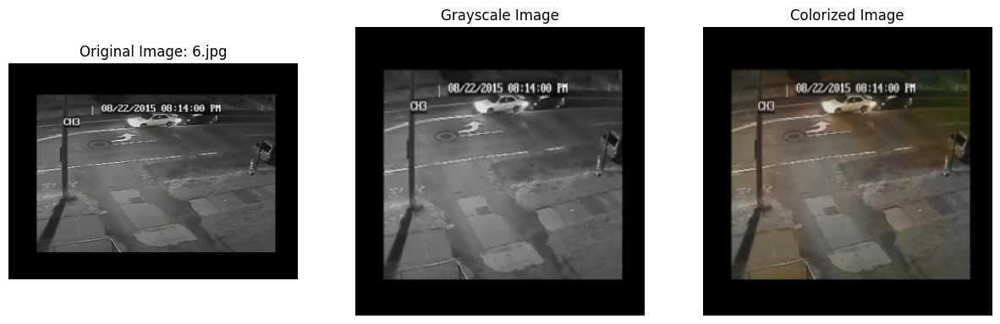

# Image Colorization Using CNN and U-Net Models

This project focuses on developing and experimenting with Convolutional Neural Networks (CNN) and U-Net architectures for image colorization. The models take grayscale images as input and predict the colorized versions in the LAB color space.





---

## Table of Contents
1. [Project Overview](#project-overview)
2. [Directory Structure](#directory-structure)
3. [Setup Instructions](#setup-instructions)
4. [Dataset Preparation](#dataset-preparation)
5. [Model Architectures](#model-architectures)
6. [Training the Models](#training-the-models)
7. [Testing and Visualization](#testing-and-visualization)
8. [Weights and Biases Integration](#weights-and-biases-integration)
9. [Results](#results)
10. [Acknowledgments](#acknowledgments)

---

## Project Overview

The goal of this project is to colorize grayscale images using deep learning techniques. Two models are implemented:
1. **CNN-based Model**: A simpler architecture for initial experimentation.
2. **U-Net Model**: A more advanced architecture designed for image-to-image tasks.

The project uses the LAB color space, where the grayscale image corresponds to the L channel, and the model predicts the AB channels.

---

## Directory Structure
```
aua-capstone/  
├── models/  
│   ├── model1/                 # CNN model
│   │   ├── cnn_model.ipynb
|   ├── model2/                 # U-Net model
│   │   ├── u-net_model_iteration_5.ipynb
│   ├── model3/                 # U-Net model
│   │   ├── u-net_model_iteration_6.ipynb
├── train_data/                 # Training dataset (not included, see Dataset Preparation)
├── nighttime_footage           # Sample unseen dataset
├── .gitignore
├── requirements.txt
├── Readme.md
├── assets/  
│   ├── sample_image_1.png      # For displaying the result in the Readme
│   ├── sample_image_2.png      # For displaying the result in the Readme
│   ├── Captsone Paper.pdf 
```
---

## Setup Instructions

1. **Clone the Repository**:
   ```bash
   git clone <repository-url>
   cd aua-capstone
   ```
2. **Set up a virtual Environment**:
    ```bash
    python3 -m venv capstone-env
    source capstone-env/bin/activate
    pip install -r requirements.txt
   ```
## Dataset Preparation
1. Download the dataset from [this](https://drive.google.com/drive/folders/1jFPg4TktUa9O0cY_mSzJHi8nlQNcZKch?usp=drive_link) public folder and place the images in the `train_data/` directory

## Model Architectures
- **CNN Model**   
A simple encoder-decoder architecture with convolutional and upsampling layers.
Defined in model1/model.ipynb.
- **U-net Model**   
A more complex architecture with skip connections for better feature preservation.
Defined in `model2/u-net_model_iteration_5.ipynb` and `model3/u-net_model_iteration_6.ipynb`.

## Training the Models
1. Preprocess the Dataset:
    - If `images.npy` and `labels.npy` exist, they will be loaded.
    - Otherwise, the dataset will be preprocessed using `prepare_data()`.
2. Train the Model:  
    Simply run the notebook files.

3. Weights and Biases Integration:  
    - Configure your WandB account and API key.
    - Training logs and metrics will be logged to WandB.

## Testing and Visualization
- **Load a Pretrained Model**:  
    - If you haven't run any notebooks, run them with correct configurations and you will see the testings and the visualizations.
    - If you have already run the notebook once and have the models as `.h5` or `.keras` files, uncomment the relevant line in the testing section to load the pretrained model:
        ```python
        model = load_model('cnn_50_epochs_model.keras', compile=False)
        ```

## Weights and Biases Integration
Weights and Biases (WandB) is used for experiment tracking. Configure it with your `entity`, `project`, and `name` in the respective notebooks.

## Results
- The CNN model is too simple and doesn't perform well.
- The first U-Net model achieves better results due to its advanced architecture, skip connections and well chosen hyperparameters.
- The second U-Net model performs poorly due to poor choice of hyperparameters and other reasons.

## Acknowledgments
This project was developed as part of the Capstone project at the American University of Armenia by **Mehher Ghevandiani**. Special thanks to the peers and the capstone supervisor **Anna Tshngryan**.